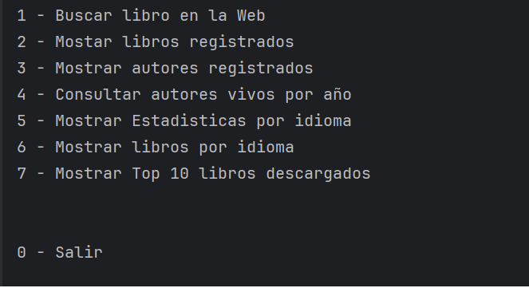

# Challenge: LiteraAlura

Este proyecto es parte del programa Alura One y consiste en una aplicación de consola en Java que permite:

- Buscar libros usando la API de [Gutendex](https://gutendex.com/)
- Guardar libros en una base de datos PostgreSQL
- Realizar búsquedas por idioma, autor y autor por año.
- Consultar estadísticas como:
  - Número de libros por idioma
  - Top 10 libros más descargados

---

Tecnologías utilizadas

- **Java 17**
- **Spring Boot**
- **Spring Data JPA**
- **PostgreSQL**
- **Gutendex API**

## Características

*Búsqueda de libros por título, autor e idioma.

*Almacenamiento eficiente de libros en PostgreSQL.

*Consultas filtradas por idioma, autor y autor por años.

*Visualización de estadísticas, como el número total de libros por idioma.

*Interfaz de consola simple y amigable.


### Como ejecutar este programa

1. Clona el repositorio
2. Configura tu archivo `application.properties` con tus credenciales de PostgreSQL:

```properties
spring.datasource.url=jdbc:postgresql://localhost:5432/tu_base_de_datos
spring.datasource.username=tu_usuario
spring.datasource.password=tu_contraseña
```
3. Ejecuta la clase ChallengeRepositorioLibrosApplication.java

#### Cómo usar el menú del programa

Al ejecutar la aplicación, verás un menú con varias opciones numeradas. Puedes interactuar escribiendo el número de la opción que deseas seleccionar y pulsando Enter.

1. **Buscar libro en la Web**  
   Busca un libro usando la API externa y lo guarda en la base de datos si no existe.  
   - Si el libro ya existe, te mostrará un mensaje indicando que ya está guardado.  
   - Luego imprimirá la información del libro.

2. **Mostar libros registrados**  
   Muestra en pantalla todos los libros guardados en la base de datos con sus detalles.

3. **Mostrar autores registrados**  
   Muestra una lista con todos los autores en la base de datos y sus libros.
   
4. **Consultar autores vivos por año**
   En base al año introducido mostrará los autores que estaban vivos en ese año. 

5. **Mostrar Estadisticas por idioma**
    Te pedirá ingresar un código de idioma (por ejemplo, `es` para Español, `en` para Inglés)
    mostrará la cantidad de libros disponibles en ese idioma.

6. **Mostrar libros por idioma**  
   Te pedirá ingresar un código de idioma (por ejemplo, `es` para Español, `en` para Inglés).  
   Luego mostrará cuántos libros hay en ese idioma.

7. **Mostrar Top 10 libros descargados**  
   Muestra una lista de los 10 libros con mayor número de descargas dentro de la base de datos.

0. **Salir**  
   Termina la ejecución del programa.

##### Demostración en video



[Video Demostrativo](demostracion/video_Demostrativo.mp4)
###### Autor
Desarrollado por Jairo Ontiveros como parte del Challenge de Alura ONE.

######## Licencia
Este proyecto se encuentra bajo la licencia MIT. Libre para usar, modificar y distribuir.
